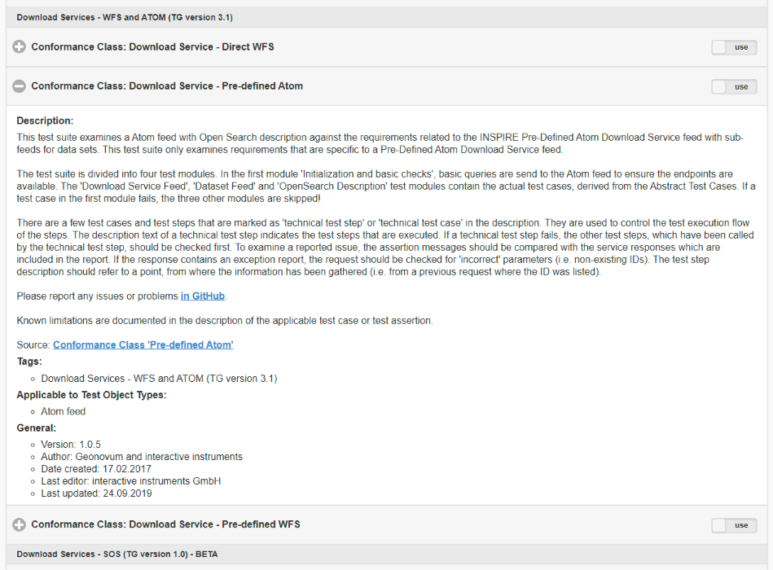

# atom-generator

Creates ATOM feeds based on the [INSPIRE Technical Guidance Download Services v3.1](https://inspire.ec.europa.eu/documents/Network_Services/Technical_Guidance_Download_Services_v3.1.pdf)

## How to run

```go
go run . -f=./example/inspire/xyz-example.yaml
```

or write to an existing directory

```bash
mkdir output
```

```go
go run . -f=./example/inspire/xyz-example.yaml -o=./output
```

## Test

```go
go test ./... -covermode=atomic
```

## Docker

### build

```docker
docker build -t pdok/atom-generator .
```

### run

```docker
docker run -it -v `pwd`/example/inspire:/config -v `pwd`/output:/output --name atom pdok/atom-generator ./atom -f=/config/xyz-example.yaml -o=/output
```

### docker-compose

In the [```example```](./example/README.md) directory is a more complex docker-compose example that will proxy some dummy files from a minio instance though a lighttpd web services as a atom feed. This example is based on the Service and Dataset Feed from the **INSPIRE Technical Guidance Download Services v3.1**

```docker-compose
docker-compose up -d
docker-compose down -v
```

The atom feeds and files can be accessed by the following URL

| file | url |
|---|---|
| Service Feed | <http://localhost/download/en.xml>|
| Dataset Feed | <http://localhost/download/waternetwork.xml> |
| Dataset Entries | <http://localhost/data/abc/waternetwork_25832.gml> |

## How to configure

The configuration is done through a YAML configuration file. The file contains a single ```service``` feed entry and multiple ```dataset``` feed entries. The defined feed entries in the configuration file are basically a 1 on 1 mapping with the ATOM xml that will be generated, with some exceptions regarding ```namespaces```, ```link``` and ```entry``` elements.

```yaml
server:
 id: "http://service.feed.org/index.xml"
 title: "Service Feed XML"
 ...

dataset:
 - id: "http://dataset.feed.org/index.xml"
   title: "Dataset Feed XML"
   subtitle: "This is a Dataset Feed XML entry"
   ...
```

### Link

Special notice needs to be take for the ```link``` elements for the ATOM configuration. The final links that are defined in the output XML are the sum of a couple of predefined ```link``` and a ```link``` array. The predefined ```link``` are:

* self
* describedby
* search
* up
  
When there are additional ```link``` entries needed they can be defined and parsed through the usage of the ```link``` array. The example below show the usage of the predefined links ```self``` and ```describedby``` and the ```link``` array providing the ```search``` and ```alternate``` link. The usage through the predefined ```link``` forces that these are INSPIRE compliant, where the usage of the ```link``` array is a free format for the user.

```yaml
   ...
   self:
     href: "http://xyz.org/download/en.xml"
     type: "application/atom+xml"
     hreflang: en
     title: "This document"
   describedby:
     href: "http://xyz.org/metadata/iso19139_document.xml"
     rel: describedby
     type: "application/xml"
   link:
    - rel: search
      href: "http://xyz.org/search/opensearchdescription.xml"
      type: "application/opensearchdescription+xml"
      title: "Open Search Description for XYZ download service"
    - href: "http://xyz.org/download/de.xml"
      rel: alternate
      type: "application/atom+xml"
      hreflang: de
      title: "The download service information in German"
      ...
```

### Entry

The Entries within the Dataset Feed that contain a ```data``` configuration will have their ```type``` and ```length``` values provided thought the ```Content-Type``` and ```Content-Length``` of a HEAD request to that object. This means that a ATOM Feed will only be generated when the file is reachable for the atom-generator. This can only be circumvented when the ```data``` field is not used and the fields ```type``` and ```length``` are 'manually' provided.

```yaml
   entry:
    - id: "http://xyz.org/data/abc/waternetwork_25832.gml"
      title: "Water network in CRS EPSG:25832 (GML)"
      link:
       - rel: alternate
         href: "http://xyz.org/data/abc/waternetwork_25832.gml"
         type: "application/gml+xml;version=3.2"
         length: 34987
         hreflang: en
         title: "Water network dataset encoded as a GML 3.2 document in ETRS89 UTM zone 32N (http://www.opengis.net/def/crs/EPSG/0/25832)"
      ...
    - id: "http://xyz.org/data/abc/waternetwork_WGS84.gml"
      title: "Water network in CRS EPSG:4258 (GML)"
      link:
       - rel: alternate
         href: "http://xyz.org/data/abc/waternetwork_WGS84.gml"
         data: "http://backed.server.org/example/xyz.gml"
         hreflang: en
         title: "Water Network encoded as a GML 3.2 document in WGS84 geographic coordinates (http://www.opengis.net/def/crs/OGC/1.3/CRS84)"
      ...
```

### Stylesheet

Through the yaml configuration a stylesheet can be provided, this an make the ATOM Feed more human readable. This can be done though the parameter ```stylesheet``` and can be a relative path related to the ATOM feed xml or a absolute path.

```yaml
service:
   stylesheet: "./style/style.xsl"
...
dataset:
 - lang: en
   stylesheet: "http://localhost/atom/style/style.xsl"
```

```xml
<?xml version="1.0" encoding="UTF-8"?>
<?xml-stylesheet href="./style/style.xsl" type="text/xsl" media="screen"?>
<feed xmlns="http://www.w3.org/2005/Atom" xmlns:georss="http://www.georss.org/georss" xmlns:inspire_dls="http://inspire.ec.europa.eu/schemas/inspire_dls/1.0" xml:lang="nl">
...
</feed>
```

## Validation

When an atom feed xml is generated this needs to be exposed as a web service and validated. For the validation of the atom feeds generated by this application the default validator is presumed to be the [INSPIRE Reference Validator](https://inspire.ec.europa.eu/validator/). This validator has a download service validator the ```Conformance Class: Download Service - Pre-defined Atom``` that can be used for testing the atom feeds.


