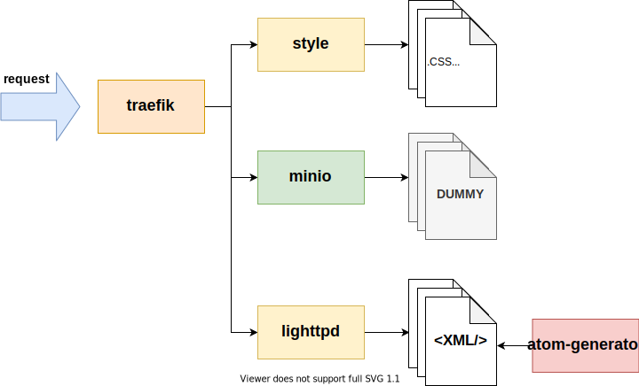

# example

This example will showcase how the atom-generator can be used in a infrastructure based on containers. The 'theory' behind this docker-compose setup can also be applied toward [k8s](https://kubernetes.io/).

## components

The example has the following containers

| container | task |
| --- | --- |
| **atom** | the atom-generator that based on the given configuration generates atom feed xml files |
| **proxy** | a web service that proxies the ```lighttpd``` and ```style``` web services so they are presented as a single service. In k8s this will be done by the ingress, [traefik](https://docs.traefik.io/) for example |
| **lighttpd** | a web service that host the atom files and proxies the ```minio``` object storage containing the dummy data files|
| **style** | a (optional) web service that host the styling for the atom service |
| **minio** | a object store that host the dummy data files for this example |

## diagram


